# Question Service Architecture

This document provides visual and detailed documentation of the question-service architecture, including pipeline flow, component interactions, and deployment configuration.

## Table of Contents

- [High-Level Overview](#high-level-overview)
- [Pipeline Flow](#pipeline-flow)
- [Component Architecture](#component-architecture)
- [LLM Provider System](#llm-provider-system)
- [Judge System](#judge-system)
- [Data Models](#data-models)
- [Deployment Architecture](#deployment-architecture)
- [Error Handling](#error-handling)

---

## High-Level Overview

The question-service generates IQ test questions through a multi-stage pipeline that leverages multiple LLM providers for generation, specialized judges for quality evaluation, and semantic deduplication to ensure uniqueness.

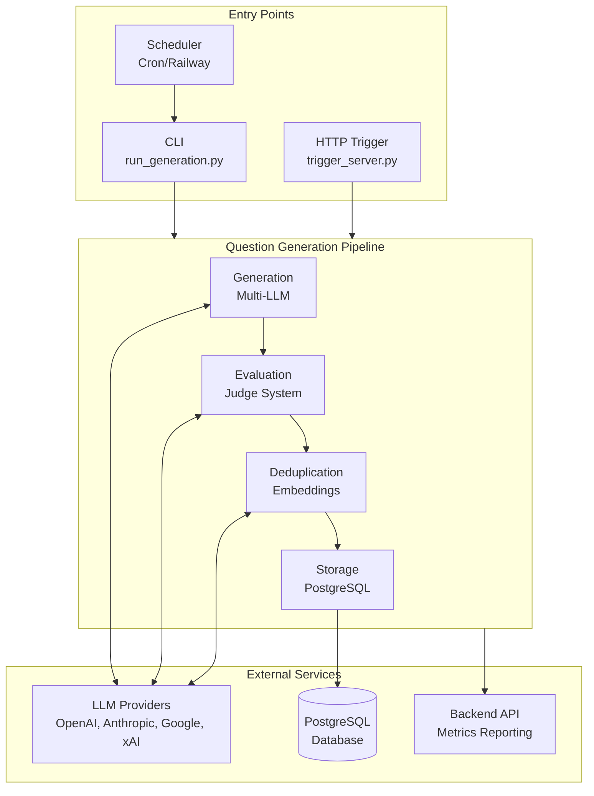

---

## Pipeline Flow

### Complete Question Generation Flow

This diagram shows the detailed flow from entry point to database storage, including all decision points and error handling.

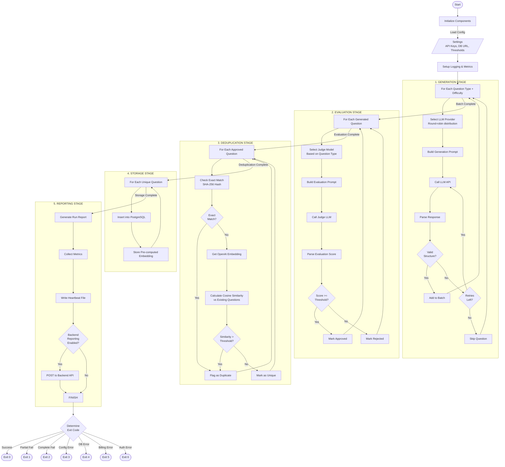

### Sequence Diagram: Single Question Lifecycle

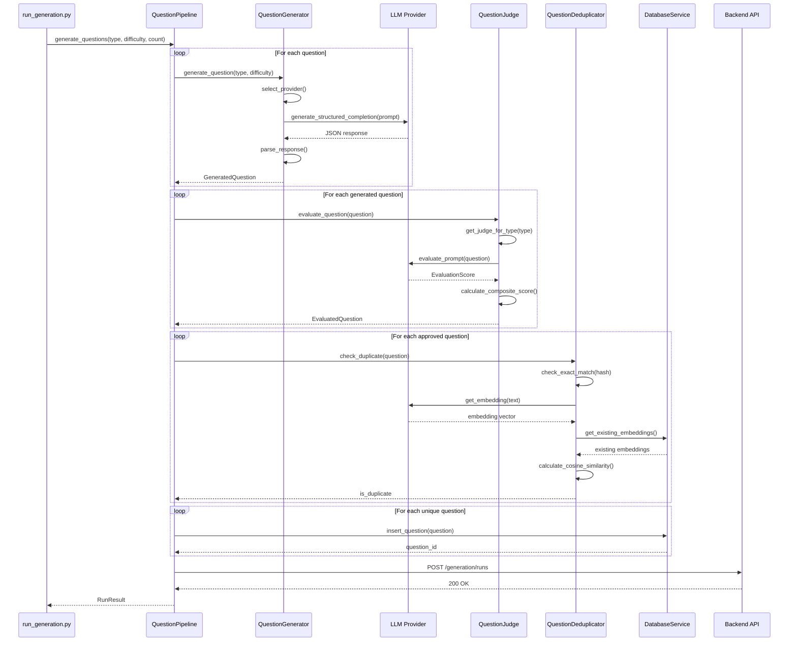

---

## Component Architecture

### Core Components and Dependencies

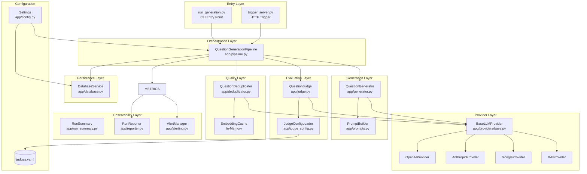

### Class Relationships

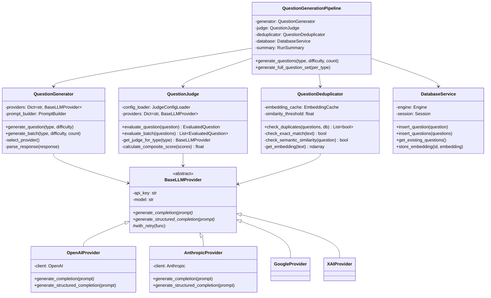

---

## LLM Provider System

### Provider Architecture

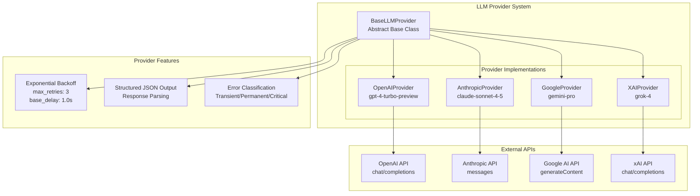

### Retry Logic Flow

```mermaid
flowchart TD
    START([API Call]) --> ATTEMPT[Make Request]
    ATTEMPT --> SUCCESS{Success?}

    SUCCESS -->|Yes| RETURN([Return Response])
    SUCCESS -->|No| CLASSIFY[Classify Error]

    CLASSIFY --> TYPE{Error Type?}

    TYPE -->|Transient| RETRY_CHECK{Retries<br/>Remaining?}
    TYPE -->|Permanent| FAIL_PERM([Fail Immediately])
    TYPE -->|Critical| ALERT[Send Alert]
    ALERT --> FAIL_CRIT([Fail with Alert])

    RETRY_CHECK -->|Yes| CALC_DELAY[Calculate Delay<br/>delay = base * 2^attempt]
    RETRY_CHECK -->|No| FAIL_RETRY([Fail After Retries])

    CALC_DELAY --> JITTER[Add Jitter<br/>random(base, delay)]
    JITTER --> CAP[Cap at max_delay]
    CAP --> WAIT[Wait delay seconds]
    WAIT --> ATTEMPT
```

---

## Judge System

### Type-Specific Judge Selection

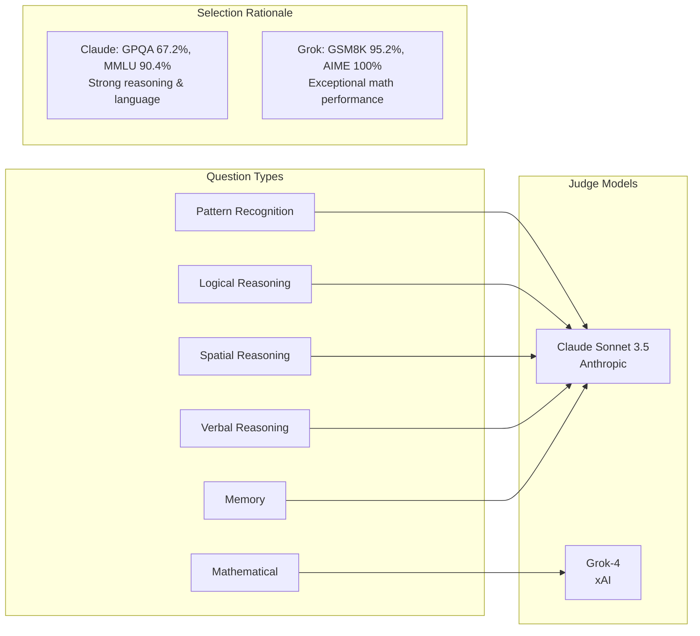

### Evaluation Scoring System

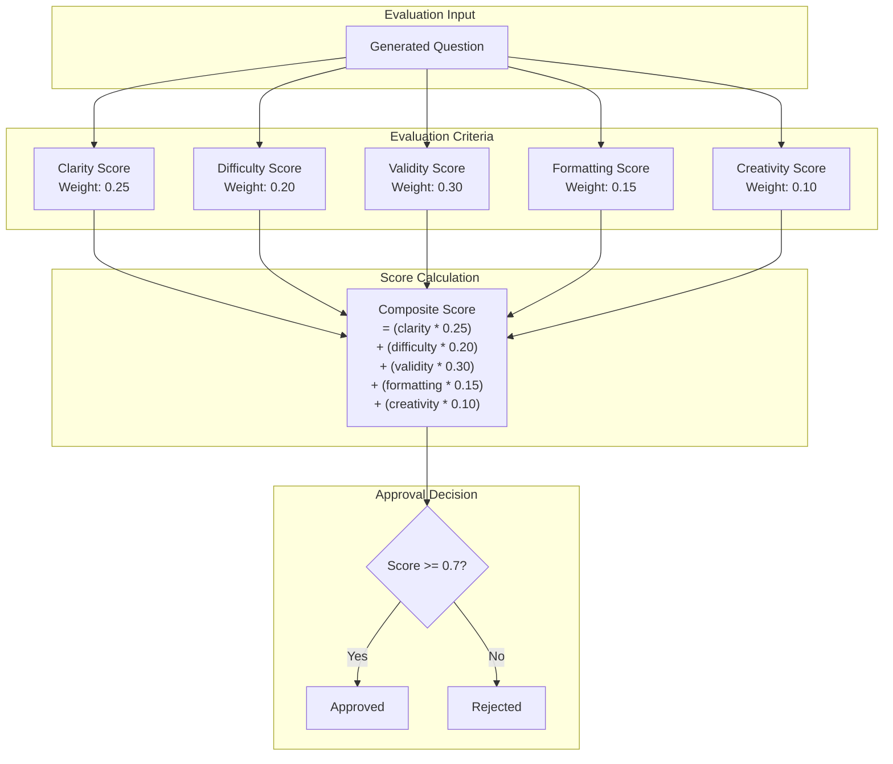

---

## Data Models

### Question Data Flow

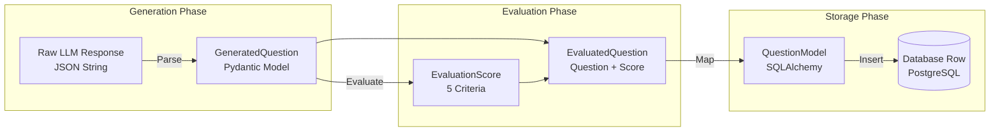

### Database Schema

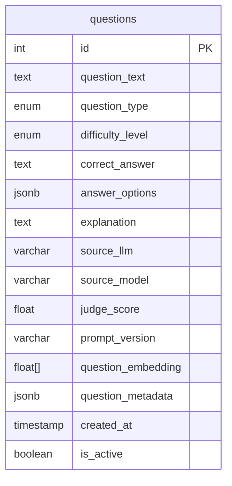

---

## Deployment Architecture

### Container Architecture

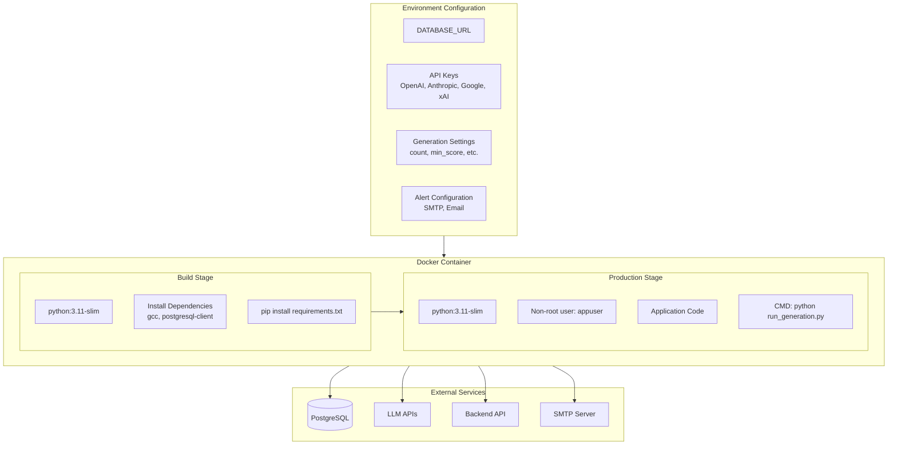

### Railway Deployment

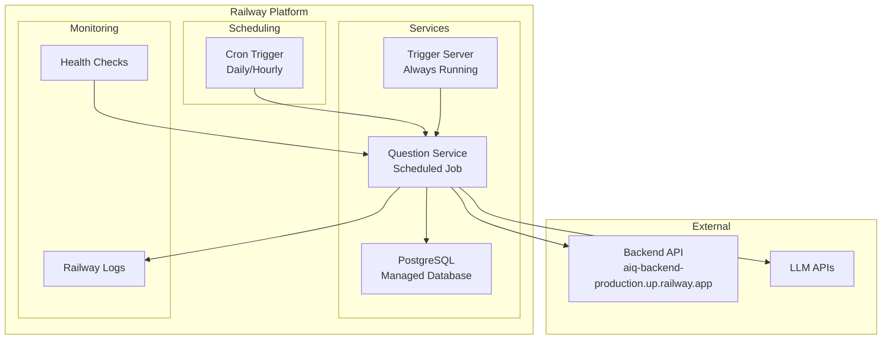

---

## Error Handling

### Error Classification System

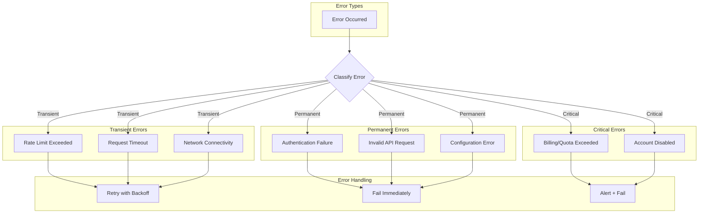

### Exit Code Decision Tree

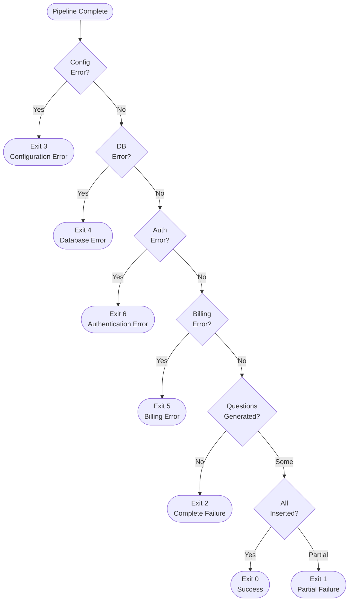

---

## Related Documentation

- **[README.md](../README.md)** - Quick start guide and overview
- **[docs/OPERATIONS.md](OPERATIONS.md)** - Operations and scheduling guide
- **[docs/ALERTING.md](ALERTING.md)** - Alert configuration
- **[docs/JUDGE_SELECTION.md](JUDGE_SELECTION.md)** - Judge model selection rationale
- **[config/README.md](../config/README.md)** - Configuration reference
